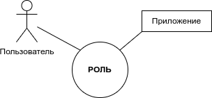
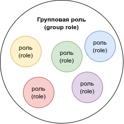
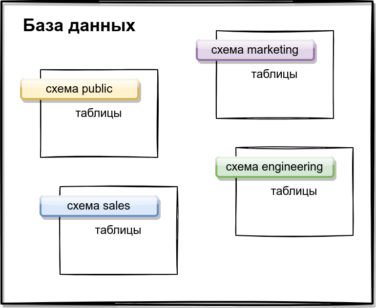

# Postgres

# Оглавление:
- [Основные команды](#main-commands)
	- [Создание БД](#create-database)
	- [Удаление БД](#delete-database)
	- [Создание таблицы](#create-database)
	- [Удаление таблицы](#delete-table)
	- [Вставка данных](#insert)
	- [Получение данных](#get-data)
	- [Псевдонимы](#alias)
	- [Значение по умолчанию](#coalesce)
	- [Эквивалетность](#nullif)
	- [Текущее время](#now)
	- [Первичный ключ](#primary-key)
	- [Значение с условием](#parameter-constraint)
	- [Удаление данных](#delete-data)
	- [Обновление данных](#update-data)
- [Внешние ключи](#foreign-keys)
    - [Объединения](#joins)
        - [По умолчанию](#inner)
        - [Левое объединение](#left-join)
- [CSV](#csv)
- [Транзакции](#transactions)
- [Индексы](#indexes)
- [Функции](#function)
- [Роли](#roles)
- [Схемы](#schemas)
- [Резервное копирование](#backup)
- [Разное](#разное)

# Main commands
## Create database
`CREATE DATABASE <db_name>;`
## Delete database
`DROP DATABASE <db_name>;`
## Create table
```
CREATE <table_name> (
	<parametr_1> <type_of_parametr> <restritions>,
	<parametr_2> <type_of_parametr> <restritions>,
	...
	<parametr_n> <type_of_parametr> <restritions>
);
```
<b>Основные ограничения</b> 
- `PRIMARY KEY (PK)` - основной идентификатор данных
- `NOT NULL` - ограничение на пустые данные
## Delete table
`DROP TABLE <table_name>;`
## Insert
```
INSERT INTO <table_name> (
	<parametr_1>,
	<parametr_2>,
	...
	<parametr_n>
)
VALUES (parametr_1, parametr_2, ..., parametr_n),
	   (parametr_1, parametr_2, ..., parametr_n);

```
## Get data
`SELECT <parametrs_for_select> FROM <table_name>;`
**Для сортировки при получении данных используется:**
- `ASC` (Ascending) - сортировка по возрастанию (по умолчанию)
- `DESC` (Descending) - сортировка по убыванию
**Выборка без повторяющихся значений**
`SELECT DISTINCT <parametrs_for_distinct> FROM <table_name>;`
**Выбор с условием**
- `SELECT <parametrs> FROM <table_name> WHERE <condition>` - простое условие
- `SELECT <parametrs> FROM <table_name> LIMIT <count>` - ограничение на количество выведенных значений
- `SELECT <parametrs> FROM <table_name> OFFSET <count>` - пропуск количества данных
- `SELECT <parametrs> FROM <table_name> LIKE <pattern>` - выборка по патерну
- `SELECT <parametrs> FROM <table_name> GROUP BY <group_parametr_1>,<group_parametr_2>, ..., <group_parametr_n>,` - группировка строк таблиц, объединенных в одну группу при совпадении значений в перечисленных параметрах
## Alias
`SELECT <parametrs> AS <alias_for_parametr>`
*Example*
`SELECT first_name AS name FROM people`
*Result*
```
 name  

-------

 Eliza

(1 row)
```
## Coalesce
`Coalesce` задает значение по умолчанию
`SELECT COALESCE (NULL, 1);`
*Result*
```
result 

-------

1

(1 row)
```
## NULLIF
`NULLIF` принимает два аргумента и возвращает первый аргумент, если второй аргумент не равен первому.
## Now
`NOW` возвращает текущую дату и время
Результат функции можно привести к необходимому типу данных
`SELECT NOW()::TIME`
## Primary Key
Задается при создании таблицы, однозначно идентифицирует запись в таблице
Чаще всего используют `BIGSERIAL` - BIGINT с авто инкрементацией
Чтобы сбросить ограничение используется
`ALTER TABLE <table_name> DROP CONSTRAINT <name_pkey>;`
Чтобы добавить ключ
`ALTER TABLE <table_name> ADD PRIMARY KEY (<parametr>);`
## Parameter Constraint
`ALTER TABLE <table_name> ADD CONSTRAINT <name_of_constaint> CHECK (<parametr> = 'data1' OR <parametr> = 'data2');`
*Example*
```
CREATE TABLE person (
	id BIGSERIAL PRIMARY KEY,
	gender TEXT NOT NULL
);

ALTER TABLE person ADD CONSTRAINT gender_valid CHECK (gender = 'male' OR gender = 'female');
```
## Delete data
Удаление стоит использовать аккуратно
`DELETE FROM <table_name> WHERE <condition;`
**DELETE FROM <table_name>** удалит все данные с таблицы
## Update data
`UPDATE <table_name> SET <parametr_1> = <value_1> WHERE <condition>;`
## ON CONFLICT DO NOTHING
`INTSER INTO ... VALUES ... ON CONFLICT (<parametrs>) DO NOTHING`
# Foreign keys
Должны ссылаться на первичные или уникальные значения, иметь тот же тип данных что и ссылочный параметр.
*Example*
```
CREATE TABLE session (
	id BIGSERIAL NOT NULL PRIMARY KEY
)
dsadsad dsad
CREATE TABLE user (
	id BIGSERIAL NOT NULL PRIMARY KEY,
	session_id BIGINT REFERENCES sesion (id)
)
```
Ссылаться можно только на уже созданные таблицы
## Joins
Для работы с соединенными БД используются присоединения (join)
Бывают:
- Inner (default)
- Left
- Right
- Full

## Inner
Объединение по умолчанию, берет только значения из пересечения таблиц
```
SELECT ... FROM <table_name_1>
JOIN <table_name_2> ON <equals_parametres>;
```
*Example*
```
SELECT * FROM person
JOIN car person.car_id = car.id;
```
Если параметры являются PK, можно использовать `USING`
```
SELECT * FROM person
JOIN car USING (id)
```
## Left join
Бывает с выбором первой таблицы или с выбором первой таблицы, у которой нет значения второй таблицы
```
SELECT ... FROM <table_name_1>
LEFT JOIN <table_name_2> ON <equals_parametres>;
```
*Example*
```
SELECT * FROM person
LEFT JOIN car ON car.id = person.car_id
```

Для выборка только левых значений

```
SELECT * FROM person
LEFT JOIN car ON car.id = person.car_id
WHERE person.id IS NULL;
```
# CSV
Чтобы сгенерировать CSV с помощью SQL
```
\copy (SELECT * FROM person LEFT JOIN car ON car.id = person.car_id) TO '/Users/kosloeb/Desktop/results.csv' DELIMITER ',' CSV HEADER;
```
# Transactions
Для выполнения нескольких операций, чтобы каждая из них выполнилась или не выполнились все.
Требования:
* Atomicity - Атомарность, гарантирует, что никакая транзакция не будет зафиксирована в системе лишь частично (или всё или ничего)
* Consistency - Согласованность, обеспечивает, что данные будут записаны лишь  в валидной форме и согласно предопределенным правилам
* Isolation - Изоляция, во время выполнения транзакции параллельные транзакции не должны оказывать влияние на её результат
* Durability - Прочность, гарантирует, что изменения, сделанные во время транзакции должны быть сохранены, если произошёл сбой на нижних уровнях
Для работы с транзакциями используются `BEGIN`, `COMMIT` и `ROLLBACK`
`BEGIN` означает начало транзакции
`COMMIT` сохранение результатов
`ROLLBACK` отмена изменений
```
BEGIN;
UPDATE accounts
SET balance = balance + 200
WHERE id = 1;

UPDATE account
SET balance = balance - 200
WHERE id = 2;
COMMIT;
```
# Indexes
Служат для ускорения поиска в таблице.
При создании PK автоматически создается индекс для него, как и для UN

Для просмотра индексов
`SELECT tablename, indexname, indexdef FROM pg_indexes WHERE schemaname = 'public';`

`CREATE INDEX <index_name> ON <table_name> (<parameter_for_index>);`

Для удаления индексов
`DROP INDEX <index_name>;`

Существуют мультииндесы
`CREATE INDEX people_first_name_last_name_idx ON people(first_name, last_name);`
Но есть ограничение, например
```
CREATE INDEX a_b_idx
ON smth(a,b);
```
При запросах:
- `WHERE a = '' AND b =''` - ускорение работает
- `WHERE a = ''` - ускорение работает
- `WHERE b = ''` - ускорение не работает
**Unique index**
`CREATE UNIQUE INDEX <index_name> ON <table_name> (<parameter_for_index>);`
Для создания уникальных индексов нужно убедиться, что данные уникальны.

**Partial index**
Частичные индексы строятся на подмножестве таблиц, например если нам нужно работать только со значениями `TRUE`
```
CREATE INDEX product_discountinued_idx
ON product (discountinued)
WHERE discontinued; -- TRUE
```

# Function
Для создания функции используется скелет функции
```
CREATE OR REPLACE FUNCTION function_name(p1 INT, p2 TEXT)
	RETURNS INT
	LANGUAGE plpgsql
AS
$$
DECLARE
-- variable declaration
  a INT;

BEGIN
-- logic
-- RETURN smth
END;
$$
```
*Example*
```
CREATE OR REPLACE FUNCTION count_by_first_name(p_first_name TEXT)
    RETURNS INT
    LANGUAGE plpgsql
AS
$$
DECLARE
--      variable declaration
    total INT;
BEGIN
    -- logic
    SELECT COUNT(*)
    INTO total
    FROM people
    WHERE first_name = p_first_name;

    RETURN total;
END;
$$
```
Чтобы использовать функцию
`SELECT count_by_first_name('Ali');`

Чтобы удалить функцию
`DROP FUNCTION <function_name>;`

# Roles
В postgres роли предоставляют разограничении между пользователями. Роль это пользователей с возможностью логирования.
Роли позволяют настроить доступ к БД и ограничить возможности пользователей.



Чаще всего роль связывает пользователя и приложение

Для более удобного управления ролями существует групповые роли, они просто содержат в себе другие роли



Для наследования свойств группы применяется `INHERIT`

Для просмотра ролей `\du`

Чтобы создать роль
`CREATE ROLE ali;`

Чтобы удалить роль
`DROP ROLE IF EXISTS ali;`

Задать параметры при создании
`CREATE ROLE ali WITH LOGIN PASSWORD 'password';`

Груповая роль
```
CREATE ROLE boys LOGIN;
GRANT boys TO ali;
```
Чтобы удалить из группы
`REVOKE boys FROM ali;`

По умолчанию созданные роли не имеют привелегий, наделение привелегиями позволяют взаимодействовать со схемами.
`GRANT SELECT ON people TO ali;`
Дать все привелегии
`GRANT ALL PRIVILEGES ON ALL TABLES IN SCHEMA public TO ali;`
Отозвать привелегии
`REVOKE ALL ON ALL TABLES IN SCHEMA public FROM ali;`

# Schemas
Схемы - позволяют организовывать работу с БД в логические группы



Для просмотра схем `\dn`

По умолчанию Postgres создает и работает в схеме `public`

Для просмотра текущей схемы в которой работаем `SELECT current_schema();`

Создание схемы
`CREATE SCHEMA sales`

Создание таблицы в новой схеме
`CREATE TABLE sales.people();`

Путь поиска (в какой схеме происходит поиск)
`SHOW search_path;`

Чтобы изменить текущий путь поиска
`SET search_path TO <schema_name>, <another_schema_name>;`
Чем левее схема в списке, тем она приоритетнее

# Backup
Резервное копирование с конкретной БД (частичное). Нужно выбирать пользователя, который имеет доступ к таблице и схеме
```
pg_dump -U kosloeb -F p testDB > testDB-backup.sql
```
(резервное копирование в _SQL_-файл)

```
pg_dump -U kosloeb -F t testDB > testDB-backup.tar
```
(резервное копирование в _tar_-файл)

Полное резервное копирование
`pg_bumpall > backup-all.sql`

Восстановление с помощью копий
- Способ №1
	- Создать новую таблицу
		`CREATE DATABASE new_db`
	- Выполнить sql-запрос из резервной копии 
		`psql -U kosloeb -d new_db -f testDB-backup.sql`
- Способ №2
	- Восстановление командой `pg_restore` (.tar файл)
		`pg_restore -d new_db testDB-backup.tar`
## Разное
- `\d "table_name"` - посмотреть внутренности таблицы name
- `\dt` - просмотр всех таблиц
- `\du` - просмотр ролей
- `\dn` - просмотр схем
- `\q` - выход из psql
- `\i` - исполнить команду и указать полный путь до файла
- `\x` - включить горизантальный режим
- `WHERE car.* IS NULL` - выбор, где любое значение car будет пустым
- Отличие `Primary Key` от `Unique` - ключ не может быть пустым, когда как уникальное значение может
- `--` - комментарии
- `SELECT tablename, indexname, indexdef FROM pg_indexes WHERE schemaname = 'public';` Посмотреть индексы и название таблиц к которым они принадлежат
- `/timing` - включает отображение времени на выполнение
- Юзер = Роль с логином
